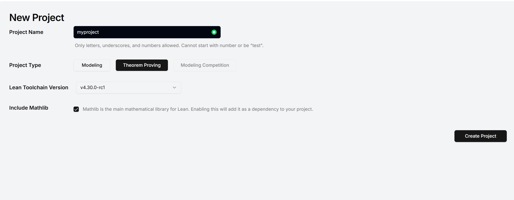
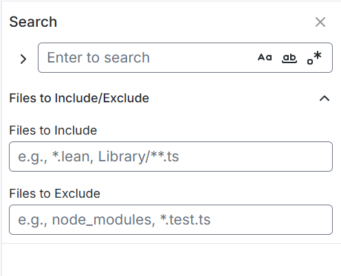
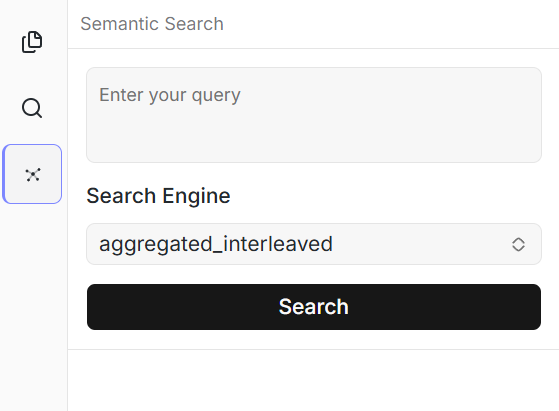

# Lean Formalization Agent

The Lean Formalization tools map the rigorous world of interactive theorem proving into an effortless visual setup alongside an AI assistant dedicated to formalizing knowledge.

## Accessing the Agent

Since Lean features are natively baked into ReasLab:
- To start, navigate to **Dashboard -> New Project** and select the **Theorem Proving** project type, then choose your `Lean toolchain Version`.

- Alternatively, start via **Theorem Proving Templates** from the home page.
The AI interaction leverages the core **Reaslingo (Reaslab-agent)** functionality. Just open any `.lean` file and use the Chat panel to invoke it.

## Basic Features

- **Rich Editor & Infoview**: Direct Lean 4 support with code highlighting, hover documentation, and an **Infoview** right sidebar tracking current goals, hypotheses, and diagnostic states.
- **Project Search & Semantic Search**: Comprehensive tools to find theorems, definition symbols, or variables (like Moogle, Lean Search, and State Search functionality).
- **Format Conversion**: The connected AI assistant can translate pure mathematical declarations written in Markdown, LaTeX, or scanned PDFs natively into Lean properties and logical code blocks!

## Example Workflow

1. Prepare your proof or theorems (e.g., inside a Markdown file or a pure `.lean` environment with empty `sorry` blocks).
2. Attach your contextual file into the workspace chat by highlighting text -> **Add to Chat**, or File Tree Right-click -> **Add File to Chat**.

3. Detail your prompt towards the AI:
   > "Please extract Theorem 2.1 from the attached Markdown file and convert it into a Lean 4 theorem declaration. Then complete the enclosed sorry blocks without altering the remaining structure."
4. Review the returned code against the right-sidebar `Infoview` which dynamically ensures tactic validity.
5. Paste or allow the AI to apply the generated logic safely.

## Sample Project
*(Project link placeholder)*

## Example Video

<video controls width="100%">
  <source src="/vedio/lean-formalization-en.mp4" type="video/mp4">
  Your browser does not support the video tag.
</video>
