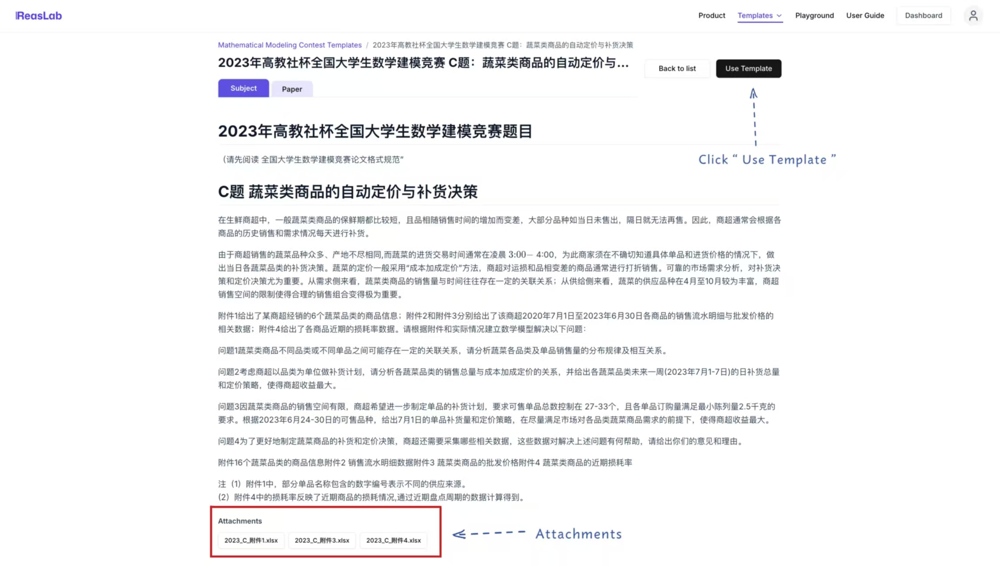
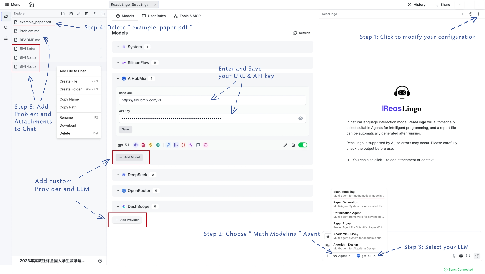

# Math Modeling Agent

The Math Modeling Agent is designed to assist you in solving complex mathematical modeling problems, analyzing data, and generating professional PDF reports based on competition templates.

## Accessing the Agent

There are two ways to access the Mathematics Modeling capabilities:
- **From Dashboard**: Go to your personal project dashboard and click on **Math Modeling Contest templates**.
- **From Home Page**: Click on the **Templates** section at the top and select **Math Modeling Contests**.

Once the project is created, open the chat interface and select **Math Modeling Agent** from the LLM dropdown list at the bottom.

## Basic Features
The Math Modeling Agent provides specific functionalities to simplify your workflow:
- **Template Generation**: Automatically sets up the project structure for mathematical modeling.
- **Context Awareness**: Seamlessly loads the competition problem and data files via "Add File to Chat".
- **Report Generation**: Capable of outputting a fully formatted LaTeX-based PDF report at the end of the task.

## Example Workflow

1. Select the "Math Modeling Contests" category and choose your target problem.
2. Click **Use Template** to instantiate your personal project workspace.

3. Once in the workspace, add the target problem (e.g., `Problem.md`) and attachment data to the chat using right-click -> **Add File to Chat**.
4. Switch the LLM to **Math Modeling Agent**.
5. Input a prompt such as:
   > "Solve the modeling problem described in Problem.md using the data in the attachments. Please generate a complete modeling report in PDF."

6. Interact with the agent as it iterates over data analysis, modeling building, and finally compiles the comprehensive report.

## Sample Project
You can view a complete sample project here:
[Math Modeling Sample Project](https://model.reaslab.io/share/BjoAQKk6SLiyx25NC4_TgQR9be542)

## Example Video

<video controls width="100%">
  <source src="/vedio/math-modeling-en.mp4" type="video/mp4">
  Your browser does not support the video tag.
</video>
