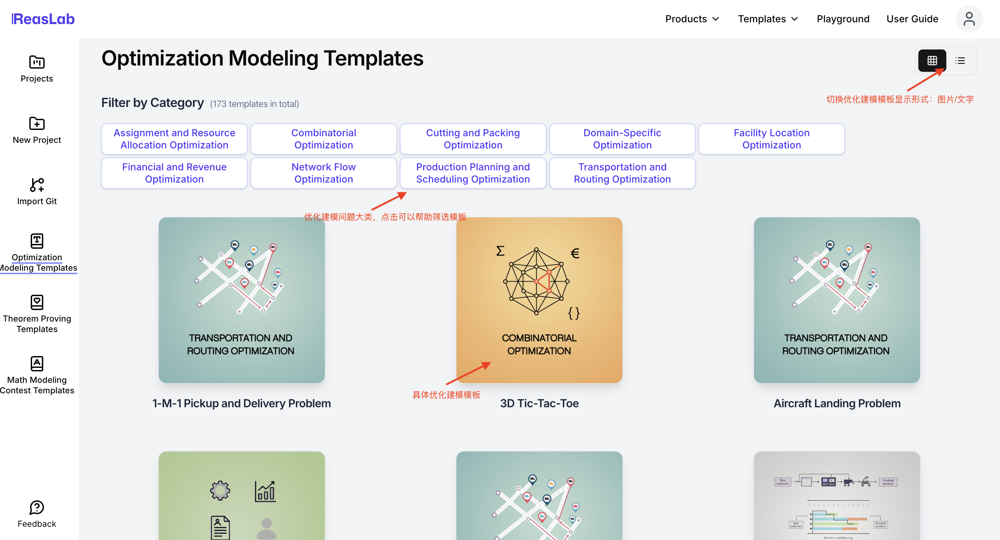
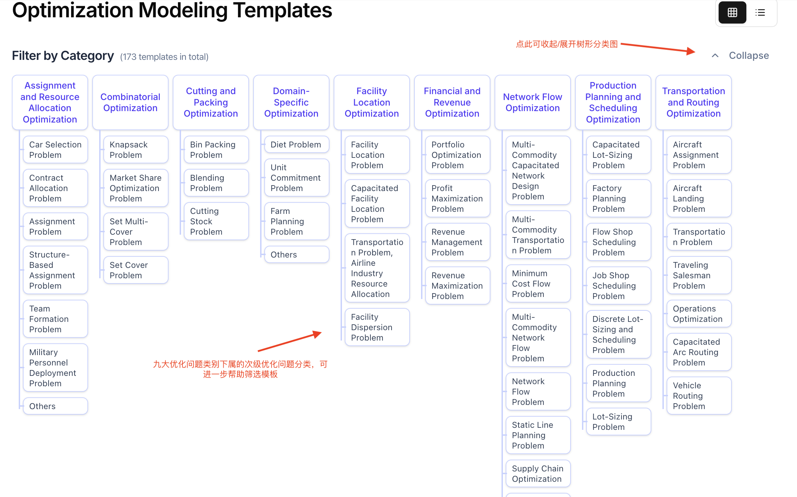
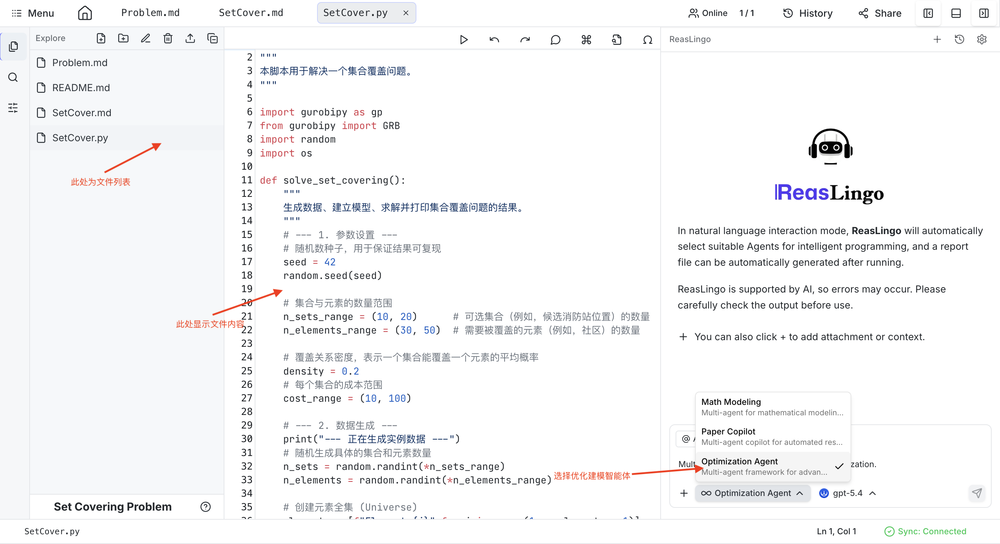
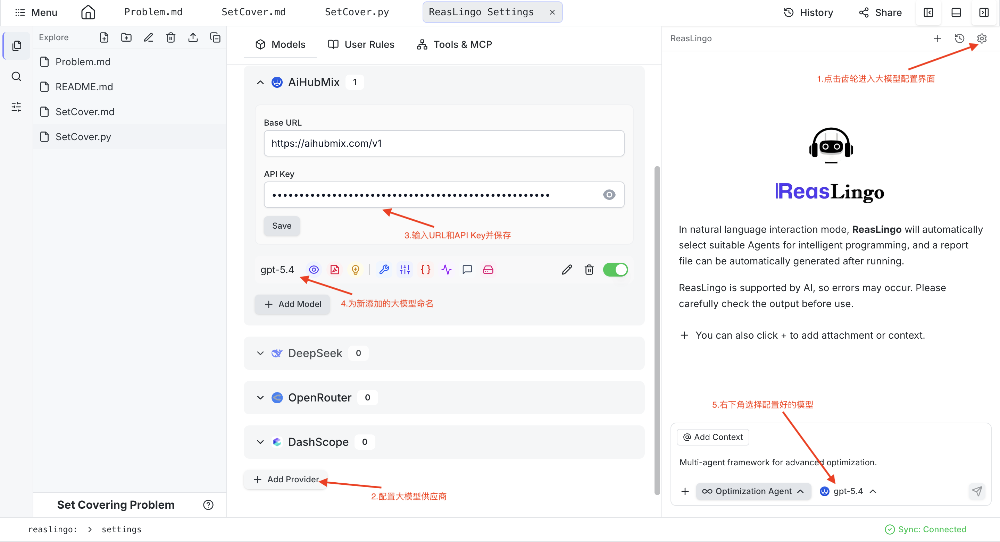
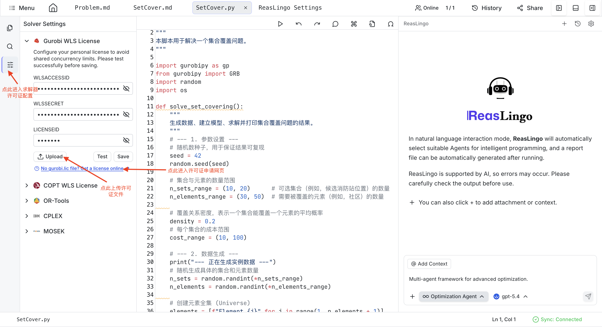

# Optimization Modeling Agent

The Optimization Modeling Agent provides a smooth template-driven experience for formalizing and solving complex mathematical optimization problems using various industry-standard solvers.

## Accessing the Agent

There are three ways to access the Optimization Modeling templates:
1. **From Dashboard**: Click on the Dashboard, then select **Optimization Modeling** on the left.

2. **From Get Started**: Click **Get Started**, then select **Optimization Modeling** on the left.

3. **From Home Page**: Under the **Templates** section at the top, select **Optimization Modeling**.

You can navigate through nine major categories and 173 sub-categories of optimization problems. Once you find your target template, click **Use Template** to create your project.

## Basic Features
- **Categorized Templates**: Browse problems easily with tree-view or flat-view layouts, complete with documentation, mathematical models, and basic Python code.
- **Interactive Solver Configuration**: Easily configure solver licenses (e.g. Gurobi, COPT) from the interface. Built-in solvers like OR-Tools and CPLEX are available out-of-the-box without extra licensing.
- **Dedicated Co-pilot**: The **Optimization Agent** assists dedicatedly with code refinement, mathematical formulation, and generating solution reports.

## Example Workflow

1. Choose a sub-category optimization template and create the project.

2. On the left sidebar, click the third icon to open the **License Configuration** panel. If using advanced solvers like Gurobi or COPT, upload your license or provide the `LICENSEID`. Click the **Test** button to ensure the configuration works, then hit **Save**.

3. Upload your problem description document (e.g., `problem.docx`) using the Add file feature.
4. In the Chat interface on the right, switch to the **Optimization Agent**.
5. Input your prompt:
   > "Solve the optimization problem described in problem.docx and generate a detailed solution report in PDF."

## Sample Project
*(Project link placeholder)*

## Example Video
*(Video placeholder)*
