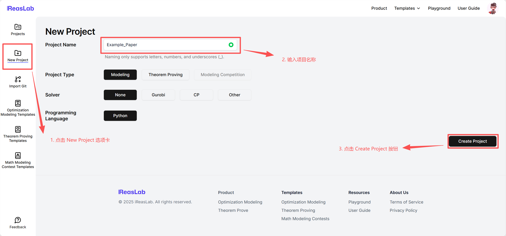
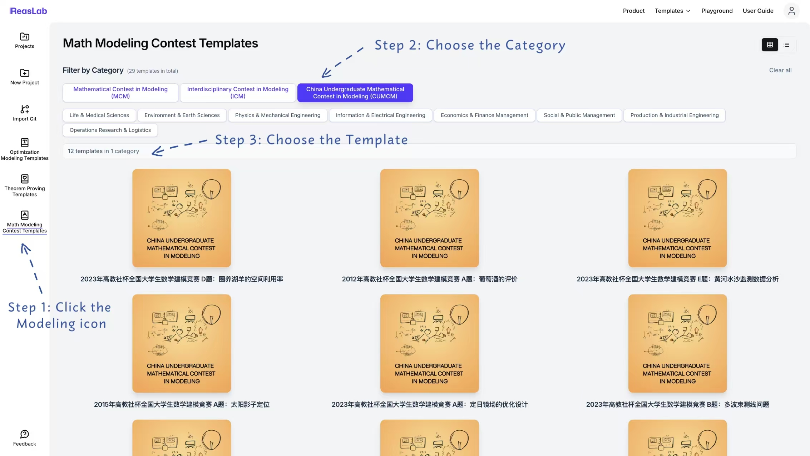
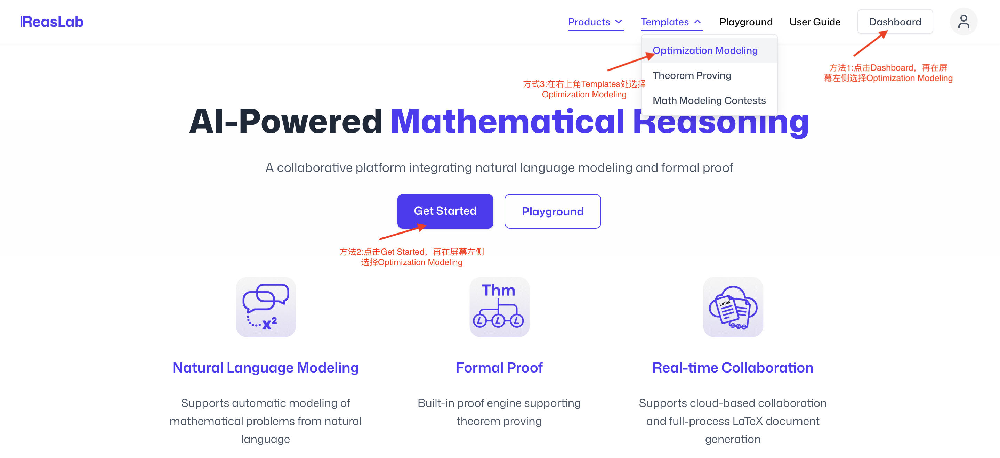

# Projects & Imports

This guide covers creating a fresh workspace, importing existing repositories, and joining shared projects via links. ReasLab supports various specialized project templates tailored to different use cases.

After logging in, you land on the Projects page where you can view and manage all your projects.

- **① Project Management tab**: Manage all your projects — filter, archive, or leave shared projects.
- **② Create Project tab**: Start a new project from scratch or from a template.
- **③ Filter**: Switch between **All Projects**, **Owned by You**, **Shared with You**, and **Archived** to keep your workspace organized.
- **④ Send Feedback**: Encounter any issues? Click this button to submit feedback — it will be filed as a GitHub issue automatically.

## Create a new project

There are multiple ways to start your journey in ReasLab, depending on whether you want a clean slate or a pre-configured environment.

### 1. Creating a Blank Project
For general-purpose scientific writing or when you want to build your own structure from scratch, use the **New Project** option.

- Enter a unique **Project Name**.
- If your project involves Lean, select the appropriate **Lean Toolchain version**.
- Click **Create** to launch the workspace.

### 2. Using Math Modeling Templates
Ideal for competition participants, these templates come with problem statements and report structures.

- Select the **Math Modeling Contests** category.
- Choose a specific competition problem to view its details.
- Click **Use Template** to instantiate the project.

### 3. Using Optimization Modeling Templates
Quickly bootstrap optimization problems with mathematical models and solver configurations.

- Navigate to the **Optimization Modeling** section.
- Browse through the categorized tree of optimization problems.
- Click **Use Template** on your chosen model.

### 4. Using Theorem Proving (Lean) Templates
Start formal verification projects with pre-configured Lean 4 environments.

- Go to the **Theorem Proving** category.
- Select a template that matches your proof assistant needs.
- Click **Use Template** to begin.

## Import from Git

1. Paste any Git URL on the import page for manual setup.
2. If you sign in with GitHub, your repositories appear automatically; otherwise, link GitHub in Account Settings.

## Join via Share Link

- If you're joining someone else's project and have a share link, sign in to your account and open the link to create and enter the project with the appropriate permissions.
