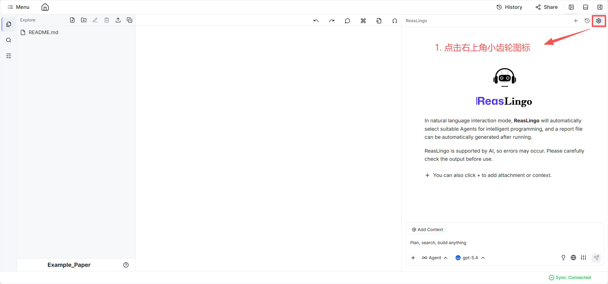
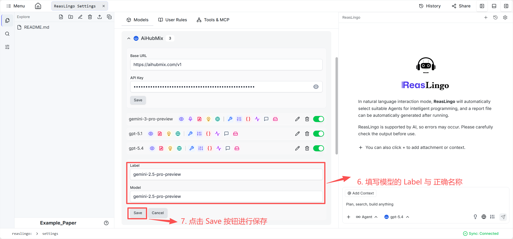

# 论文生成智能体

通过论文生成智能体（Paper Copilot），您能在 ReasLab 平台中丝滑地进行端到端的科学研究与学术论文写作。

## 进入方式

使用原本的新建项目选项或者选择 Paper Generation 项目模板即可进入工作区。

然后，打开聊天面板（并在此之前请确保配置了您的 LLM 供应商信息），在下拉列表中选择 **Paper Copilot** 即可开启科学写作之旅。

## 基础功能

科学写作助手采用主副智能体（Multi-Agent）协同架构。主智能体负责理解意图并规划科研任务，并调遣如下六大专属子智能体来进行功能拆解：
- **@survey** / **@survey-auto**：进行文献调研，撰写摘要与 related work 章节。
- **@algorithm** / **@algorithm-auto**：设计算法，给出伪代码并借由 Python 验证可行性。
- **@prover** / **@prover-auto**：为算法建立理论性质，自动提供假设并进行定理推演证明。
- **@experiment** / **@experiment-auto**：设计并执行实验，审查自主产生的实验结果。
- **@intro** / **@intro-auto**：总结研究进展，撰写 Introduction。
- **@paper**：综合所有实验与推理进程，生成最终的论文。

*(注：后缀 `-auto` 代表进入全自动化运转模式，默认则为人工交互确认的模式)*

## 范例流程

为了能够最大化发挥智能体的能力，推荐采用如下标准流程：
1. **指令输入**：用自然语言给定初始的科研或论文需求 prompt。
2. **产生计划**：Copilot 会先给出一份初步的科研步骤路线计划。
3. **用户反馈**：您可以提出细节修改，或是输入"Continue"允许智能体照做。

4. **执行迭代**：Copilot 按照方案执行子任务，每个阶段均会给出内容及下一步摘要。
5. **手动纠偏**：如果在部分过程中发现生成的环节或子系统效果未达预期，用户可以随时利用特定的 AT 语法（如 `@experiment`）单独切入并深度优化某一领域。
6. **产出终稿**：Copilot 会汇聚所有内容生成论文的最终 PDF 版本。

## 示例项目
*(项目链接占位符)*

## 范例视频

**English Version**

<video controls width="100%">
  <source src="/vedio/paper-generation-en.mp4" type="video/mp4">
  您的浏览器不支持视频标签。
</video>

**中文版**

<video controls width="100%">
  <source src="/vedio/paper-generation-cn.mp4" type="video/mp4">
  您的浏览器不支持视频标签。
</video>
